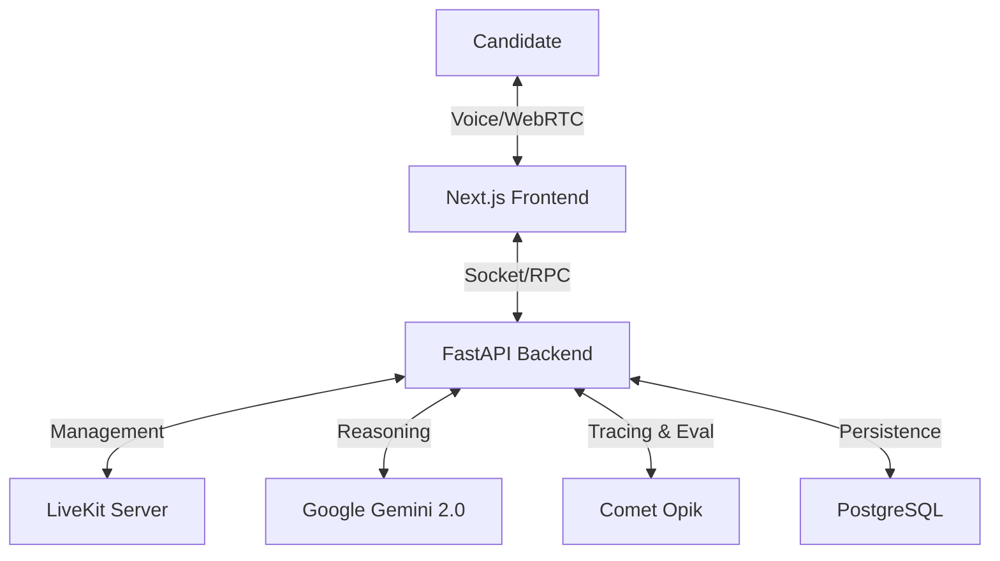

# Opik Career Agent 🚀

> **The AI Career Coach That Verifies Your Skills (So You Don't Have To Guess).**
> *Submission for Comet Resolution V2 Hackathon*

## 📖 Overview

**Opik Career Agent** is a real-time, voice-enabled AI mock interviewer designed specifically for software developers. It helps you practice for your dream role (e.g., "Senior Backend Engineer") by simulating realistic interview scenarios—from HR screening to deep technical architecture reviews.

But unlike standard chatbots, **Opik Career Agent offers proof**. We integrate **Comet Opik** to trace, evaluate, and verify every answer you give, providing data-driven feedback that bridges the gap between practice and reality.

## 🎥 Demo

[Insert Demo Video Link Here]

## ⚡ Key Features

- **🗣️ Voice-Native Interface**: Powered by **LiveKit** and **Cartesia (Sonic)**, the agent speaks and listens in real-time with ultra-low latency. It feels like a Zoom call with a human.
- **🤖 Adaptive Intelligence**: Using **Google Gemini 2.0**, the agent dynamically adjusts question difficulty based on your performance. If you answer a basic question well, it digs deeper.
- **📊 Verified Feedback (Powered by Opik)**: No hallucinations. Every interview session is a structured trace where your "Seniority Score" is calculated based on granular evaluation metrics.
- **🔄 Full Interview Loop**:
  - **HR Screening**: Culture fit, salary expectations, and soft skills.
  - **Technical Assessment**: System design, coding challenges (verbal), and architecture trade-offs.
  - **Behavioral**: STAR method verification for leadership and conflict resolution.
- **📈 Progress Tracking**: Visual dashboards show your growth in key competencies (Communication, System Design, Algorithms) over time.

## 🛠️ Architecture

The project is built on a modern, observable stack:



## 🔍 How We Use Opik

Opik is the "referee" of our system. We rely on it for:

1.  **Session Tracing**: Every interview session is initialized as a unique Opik Trace, capturing metadata like Job Role, Tech Stack, and Difficulty Level.
2.  **Span-Level Observability**: We trace every conversational turn (User Speech -> STT -> LLM Reasoning -> TTS) to debug latency and response quality.
3.  **Real-Time Metrics**: We use `opik.record_metric` to log "Answer Quality" and "Difficulty State" for every turn.
4.  **LLM Evaluation**: Post-session, we run a GEval process using Opik to generate a comprehensive "Suitability Score" that is linked directly to the session trace.

## 💻 Tech Stack

-   **Frontend**: Next.js 15, TypeScript, TailwindCSS, LiveKit Client SDK, Radix UI.
-   **Backend**: Python, FastAPI, SQLAlchemy (AsyncPG).
-   **AI/ML**:
    -   **LLM**: Google Gemini 2.0 Flash
    -   **TTS**: Cartesia (Sonic)
    -   **STT**: Google Cloud Speech-to-Text / Deepgram
    -   **VAD**: Silero VAD
-   **Observability**: Comet Opik
-   **Infrastructure**: Docker, Docker Compose, Postgres.

## 🚀 Getting Started

### Prerequisites

-   Docker & Docker Compose
-   Node.js 18+
-   Python 3.10+
-   API Keys for: LiveKit, Google Gemini, Cartesia, and Comet Opik.

### 1. Clone the Repository

```bash
git clone https://github.com/your-username/opik-career-agent.git
cd opik-career-agent
```

### 2. Environment Setup

**Backend**:
Copy `backend/.env.example` to `backend/.env` and fill in your keys.

```bash
cd backend
cp .env.example .env
# Edit .env with your keys
```

**Frontend**:
Copy `frontend/.env.example` to `frontend/.env.local`.

```bash
cd ../frontend
cp .env.example .env.local
# Edit .env.local with your keys
```

### 3. Run with Docker (Backend)

Start the database, backend API, and worker agent.

```bash
cd ../backend
docker-compose up --build
```

The backend API will be available at `http://localhost:8000`.

### 4. Run Frontend

```bash
cd ../frontend
npm install
npm run dev
```

Open `http://localhost:3000` in your browser.

## 📄 License

MIT License. Built with ❤️ for the Opik Hackathon.
